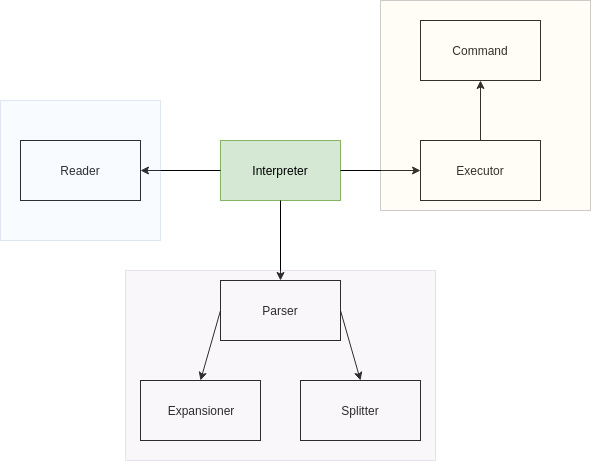

# Архитектура интерпретатора

В программе выделено 3 основных модуля. Один из них отвечает за чтение пользовательского ввода, один
за его дальнейший парсинг, а еще один за исполнение последовательностей команд. 

Все команды наследуются от абстрактного класса AbstractCommand.

Предполагается, что сам класс Interpretator никакой полезной работы совершать не должен. 
От него лишь требуется последовательно вызвать 3 другие компоненты.
